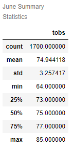
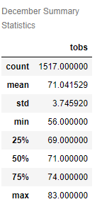

# Overview of Project:

As our client wanted to developpe a Surf'Shake shop in Hawaii main island Oahu, where the concept was to sell surfing goods as well as ice cream treats. We have been tasked to showcase weather trends to a board of investors. 
Our problematic was to ensure the sustainability of the business based on year-around weather and determined the appropriated location to implant it. 

# Results:

To fulfilled this task we decided to analyse temperature trends on Oahu for the month of June and December. That permitted us to give a description of the year-around weather. 
Based on our work we were able to light on some keys differences between winter and summer:

- The average temperature was higher during summer time.
- The standard deviation is lower for June(3.24), that informed us on the fact that in summer the temperature tended to be closer to the average temperature. The lowest June temperature was an exception based on the summary. On the contrary of the month of December(3.74), which means temperatures were spread out over a wider range during winter.
- Overall temperature are lower during winter time even if the maximum temperature was almost similar.
- However, the count of values to analyse was lower in the month of December and could have an impact on the overall summary statistics.
                                           
  

# Summary:

Based on our analysis, we could see that temperature trends year-around are overall high enough to sustained a Surf'Shake shop. Consistent temperature average during summer (who actually match with tourism season). During winter even with a drop of temperature there were still enough warm days to sustain this business concept. 
However to answer the second part of our problematic (location) we would need to analyse more parameters:
- We could analyse the amount of precipitation to showcase even if the temperature are high, how the rainfall could have an impact.
- Also  knowing the weather trends based on the elevation could give insights on the best location around the island to implant the shop.

